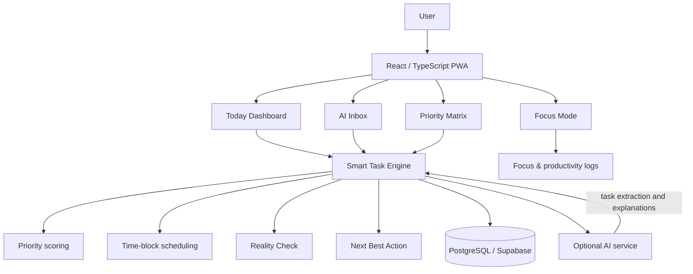

# Smart Task

> **Your tasks know what needs to be done. Smart Task knows what you should do next.**

Smart Task is a mobile-first productivity workspace designed for people who are overwhelmed by disconnected task lists, calendars, deadlines, and focus tools. Instead of simply storing tasks, Smart Task turns a messy workload into a clear next action.

The current repository contains a polished, interactive prototype that demonstrates the core product experience: prioritization, explainable recommendations, capacity awareness, scheduling, and focus sessions.

## Why Smart Task?

Most productivity tools answer:

> “What tasks do I have?”

Smart Task answers:

> **“What should I work on right now, and why?”**

It brings the most important signals together:

```text
Tasks + deadlines + effort + dependencies + available time
                              ↓
                    Smart Task recommendation
```

## Prototype highlights

| Experience | What it demonstrates |
| --- | --- |
| **Next Best Action** | Recommends one high-impact task instead of presenting an overwhelming list |
| **Explainable priority** | Shows why a task was selected: deadline, dependencies, effort, and capacity |
| **Reality Check** | Compares planned work with available time and surfaces schedule risk |
| **Smart Schedule** | Presents focused time blocks with task duration and status |
| **Focus sessions** | Starts a distraction-free work session from the recommended task |
| **AI Inbox concept** | Provides a home for natural-language task capture and future voice input |
| **Responsive workspace** | Designed for desktop dashboards and smaller mobile screens |

## Product flow

```text
CAPTURE → UNDERSTAND → PRIORITIZE → REALITY CHECK → PLAN → FOCUS → LEARN
```

## Architecture

The prototype is intentionally dependency-light so the core interaction can be evaluated quickly. The planned production architecture keeps deterministic productivity logic reliable while using AI where it adds the most value.



### Design principles

- **Rules first, AI second:** deadlines, capacity, and scheduling remain predictable even when an AI service is unavailable.
- **Explainability by default:** recommendations should be understandable, not mysterious.
- **Mobile-first:** the essential action should be reachable quickly on a phone.
- **Progressive integrations:** start with manual capture and calendar data; add voice and external productivity apps without coupling the core experience to them.
- **Privacy-aware:** AI calls should be made through a trusted server or edge function, never with exposed browser API keys.

## Planned intelligence layer

The production priority engine can normalize task signals to a `0–100` score:

```text
priority =
    deadline urgency × 0.35
  + importance        × 0.30
  + dependency impact × 0.20
  + goal relevance    × 0.15
```

The scheduling engine then:

1. Finds free time around calendar events.
2. Sorts tasks by priority, deadline, and estimated effort.
3. Fits work into available slots.
4. Adds breaks and focus blocks.
5. Detects when planned work exceeds capacity.
6. Suggests what to postpone or split.

## Technology direction

| Layer | Recommended technology |
| --- | --- |
| Prototype | HTML, CSS, vanilla JavaScript, Node.js static server |
| Production UI | React, Vite, TypeScript, Tailwind CSS |
| State and data fetching | Zustand and TanStack Query |
| PWA | Web App Manifest, service worker, `vite-plugin-pwa` |
| Backend | Supabase Auth, PostgreSQL, Edge Functions |
| AI | Server-side LLM integration for extraction and explanations |
| Mobile assistant bridge | Capacitor Android wrapper and Android App Actions |
| Testing | Vitest, React Testing Library, and Playwright |

## Run the prototype locally

Requirements:

- Node.js 18 or newer

Start the local server:

```bash
node server.js
```

Open:

```text
http://127.0.0.1:4173
```

The prototype has no package installation step. It is intentionally self-contained for quick demos.

## Repository structure

```text
.
├── index.html    # Smart Task dashboard and prototype layout
├── style.css     # Responsive visual system and component styles
├── app.js        # Interactive task, modal, focus, and navigation behavior
├── server.js     # Minimal local static-file server
└── README.md     # Product and technical documentation
```

## Demo walkthrough

1. Open the Today dashboard.
2. Review the recommended **Next Best Action**.
3. Select **Why this task?** to see the recommendation explanation.
4. Complete a task from the prioritized list.
5. Open **Review my plan** to inspect the capacity check.
6. Start a focus session from the recommended task.
7. Use the navigation to preview AI Inbox, Priority Matrix, Smart Schedule, and Insights.

## Roadmap

### Now

- Interactive dashboard prototype
- Priority-focused task list
- Explainable recommendation flow
- Responsive mobile layout
- Focus-session entry point

### Next

- Real task creation and persistence
- Dynamic Eisenhower Matrix
- Deterministic priority and scheduling engine
- Calendar availability
- Actual Pomodoro timer and session history

### Later

- Natural-language and voice task capture
- Google Calendar integration
- Android assistant actions through Capacitor
- Adaptive time estimates based on completion history
- Weekly productivity insights

## Scope guardrails

Smart Task is deliberately not trying to build every integration at once. The first production milestone should prioritize a reliable loop:

```text
Create task → understand priority → fix the plan → focus → complete
```

Integrations such as email, Slack, Notion, and Teams can be added after this loop is useful on its own.

## Status

**Prototype / demo** — the UI and interactions are ready for product review and demonstration. Persistence, authentication, live AI services, and native assistant actions are planned production features.

## License

See [LICENSE](./LICENSE).
